# **Analysis of Flight Delays in the United States**
##### Gowtham Senthil, Surendra Kumar Chandrasekaran, Yaswanth Kottana
---
## **Introduction**
Some of you might have experienced flight delays during your travels. It's frustrating when your perfectly planned trip gets disrupted due to unforeseen delays. We have all been there. But, the thing is, sometimes you can't avoid them entirely. However, this got us thinking, what could be the reasons behind these delays? What if we can find patterns that contribute to flight delays? Even if you have never experienced a flight delay, knowing the reasons behind will help you decide better while booking your next flight. We all have busy lives, so why make travel more complicated?

Flight delays are a significant challenge in the aviation industry, costing airlines billions of dollars annually and affecting millions of passengers. According to the [FAA](https://www.faa.gov/), delayed flights can lead to missed connections, disrupted schedules, and decreased customer satisfaction.

In this tutorial, we'll analyze flight delay patterns in the United States using data from the [Bureau of Transportation Statistics (BTS)](https://www.transtats.bts.gov/). Our goal is to build a predictive model that can identify flights at high risk of delays, potentially helping airlines and passengers make better decisions.

To find patterns and perform predictive analysis, the best tool in our hand is Data Science. So, we will be going through the life cycle of data science starting with collecting the data, cleaning it, exploring it, visualizing it, building a predictive model and drawing insights from it.

We will be using Python and other popular data science libraries in Google Colab for this tutorial. Colab is amazing if you are just starting your data science journey. You can learn more about [Google Colab here](https://colab.research.google.com/notebooks/intro.ipynb).

### Mounting Google Drive
First, we'll mount Google Drive to access our dataset files. You can skip this step if you're running the notebook locally, and had downloaded the dataset files to your local machine.


```python
from google.colab import drive
drive.mount('/content/drive')
```

### Installing Required Libraries

We'll need several Python packages for our analysis:
- `category_encoders`: For advanced categorical encoding techniques
- `xgboost`: A powerful gradient boosting library for classification
- `imbalanced-learn`: For handling class imbalance in our dataset

These libraries extend scikit-learn's capabilities and are essential for building robust predictive models. Learn more about [XGBoost](https://xgboost.readthedocs.io/) and [imbalanced-learn](https://imbalanced-learn.org/).


```python
#code to install required libraries
!pip install category_encoders xgboost imbalanced-learn
```

    Collecting category_encoders
      Downloading category_encoders-2.9.0-py3-none-any.whl.metadata (7.9 kB)
    Requirement already satisfied: xgboost in /usr/local/lib/python3.12/dist-packages (3.1.2)
    Requirement already satisfied: imbalanced-learn in /usr/local/lib/python3.12/dist-packages (0.14.0)
    Requirement already satisfied: numpy>=1.14.0 in /usr/local/lib/python3.12/dist-packages (from category_encoders) (2.0.2)
    Requirement already satisfied: pandas>=1.0.5 in /usr/local/lib/python3.12/dist-packages (from category_encoders) (2.2.2)
    Requirement already satisfied: patsy>=0.5.1 in /usr/local/lib/python3.12/dist-packages (from category_encoders) (1.0.2)
    Requirement already satisfied: scikit-learn>=1.6.0 in /usr/local/lib/python3.12/dist-packages (from category_encoders) (1.6.1)
    Requirement already satisfied: scipy>=1.0.0 in /usr/local/lib/python3.12/dist-packages (from category_encoders) (1.16.3)
    Requirement already satisfied: statsmodels>=0.9.0 in /usr/local/lib/python3.12/dist-packages (from category_encoders) (0.14.5)
    Requirement already satisfied: nvidia-nccl-cu12 in /usr/local/lib/python3.12/dist-packages (from xgboost) (2.27.5)
    Requirement already satisfied: joblib<2,>=1.2.0 in /usr/local/lib/python3.12/dist-packages (from imbalanced-learn) (1.5.2)
    Requirement already satisfied: threadpoolctl<4,>=2.0.0 in /usr/local/lib/python3.12/dist-packages (from imbalanced-learn) (3.6.0)
    Requirement already satisfied: python-dateutil>=2.8.2 in /usr/local/lib/python3.12/dist-packages (from pandas>=1.0.5->category_encoders) (2.9.0.post0)
    Requirement already satisfied: pytz>=2020.1 in /usr/local/lib/python3.12/dist-packages (from pandas>=1.0.5->category_encoders) (2025.2)
    Requirement already satisfied: tzdata>=2022.7 in /usr/local/lib/python3.12/dist-packages (from pandas>=1.0.5->category_encoders) (2025.2)
    Requirement already satisfied: packaging>=21.3 in /usr/local/lib/python3.12/dist-packages (from statsmodels>=0.9.0->category_encoders) (25.0)
    Requirement already satisfied: six>=1.5 in /usr/local/lib/python3.12/dist-packages (from python-dateutil>=2.8.2->pandas>=1.0.5->category_encoders) (1.17.0)
    Downloading category_encoders-2.9.0-py3-none-any.whl (85 kB)
       ━━━━━━━━━━━━━━━━━━━━━━━━━━━━━━━━━━━━━━━━ 85.9/85.9 kB 3.3 MB/s eta 0:00:00
    [?25hInstalling collected packages: category_encoders
    Successfully installed category_encoders-2.9.0
    

### Importing Core Libraries

We import essential libraries for data manipulation, visualization, and machine learning:
- **pandas**: Data manipulation and analysis
- **matplotlib & seaborn**: Data visualization
- **scikit-learn**: Machine learning algorithms and utilities
- **numpy**: Numerical computing

It's important to know atleast the basics of these libraries to follow along with the tutorial. Find their resources at [pandas](https://pandas.pydata.org/), [matplotlib](https://matplotlib.org/), [seaborn](https://seaborn.pydata.org/), [scikit-learn](https://scikit-learn.org/stable/) and [numpy](https://numpy.org/doc/stable/).

It's okay if you are feeling overwhelmed right now. With more practice, you'll get comfortable with these libraries.

We also suppress warnings to keep our output clean.


```python
import pandas as pd
import glob
import os
import warnings
warnings.filterwarnings('ignore')
```


```python
import pandas as pd
import matplotlib.pyplot as plt
import seaborn as sns
import numpy as np

from sklearn.model_selection import train_test_split
from sklearn.metrics import classification_report, roc_auc_score, confusion_matrix
from imblearn.over_sampling import SMOTE
import xgboost as xgb
import category_encoders as ce

from sklearn.ensemble import RandomForestClassifier
```

## **Data Collection**
### Download and import the data

**Data Source:** [Bureau of Transportation Statistics - On-Time Performance](https://transtats.bts.gov/Fields.asp?gnoyr_VQ=FGJ)

Once you go to this website, you will see download button to your left of the main data description table, under data tools. Once you click on download, it will take you to a new page where you can select the year and month of data you want to download. For this tutorial, we have taken very recent data for more accurate analysis, from January to July 2025. Once you have different months data, you can upload them to google drive and follow what we have done in previous section to mount google drive, and load multple csv files using glob or any other method you prefer.

This dataset contains detailed information about domestic flights in the United States, including scheduled and actual departure times, delays, and cancellations.

### Loading Multiple CSV Files

The BTS provides monthly flight data in separate CSV files. We'll use `glob` to identify all CSV files in our data directory and combine them into a single DataFrame using `pd.concat()`.


```python
#if you are running this code locally, change the folder_path to the folder location where you have saved the dataset files
folder_path = '/content/drive/MyDrive/DS Final Project Data'
csv_files = glob.glob(os.path.join(folder_path, "*.csv"))
combined_df = pd.concat((pd.read_csv(f) for f in csv_files), ignore_index=True)
```

### Exploring Dataset Structure

Let's examine the structure of our combined dataset to understand:
- Total number of records
- Available columns
- Data types
- Memory usage

This helps us plan our data processing strategy and identify potential issues early.


```python
combined_df.info()
```

    <class 'pandas.core.frame.DataFrame'>
    RangeIndex: 4505420 entries, 0 to 4505419
    Columns: 119 entries, YEAR to DISTANCE_GROUP
    dtypes: float64(70), int64(22), object(27)
    memory usage: 4.0+ GB
    

# Dataset Structure Overview

**Dimensions:** 4,505,420 rows $\times$ 119 columns
**Memory Usage:** 4.0+ GB
**File Format:** Pandas DataFrame

### Data Type Distribution
| Data Type | Count | Description |
| :--- | :--- | :--- |
| **float64** | 70 | Likely continuous variables, metrics, or integers containing `NaN` values. |
| **object** | 27 | Text data, categorical strings, or mixed types. |
| **int64** | 22 | Whole numbers (counts, IDs, or flags). |
| **Total** | **119** | |

## **Data Processing**

### Feature Selection Rationale

Not all columns in the raw dataset are relevant for predicting departure delays. We've carefully selected features based on their potential predictive power and relevance to our research question.

The table below explains our reasoning for including each feature. This selection is informed by domain knowledge about factors that commonly contribute to flight delays, such as time of day, airport congestion, and airline operational differences.

| **Column name**     | **Why include it**                                                                                                                                                                                                                          |
| ------------------- | ------------------------------------------------------------------------------------------------------------------------------------------------------------------------------------------------------------------------------------------- |
| `DAY_OF_MONTH`      | Captures variation within a month — e.g. early-month vs end-month scheduling or periodic demand spikes.                                                                                                                                     |
| `DAY_OF_WEEK`       | Encodes weekly patterns — weekday vs weekend may affect traffic, staffing, airport/airspace congestion, and thus delay risk.                                                                                    |
| `OP_UNIQUE_CARRIER` | Airline identity — different carriers show different on-time performance, operational practices, resources, and reliability.                                                                                             |
| `ORIGIN`            | Origin airport — delays often depend heavily on airport-specific factors (traffic volume, runway/gate congestion, local operations).                                                                                     |
| `DEST`              | Destination airport — though departure delay happens at origin, flight distance and destination can influence scheduling and buffer padding, which may impact likelihood of delay or decision to pad schedule.  |
| `CRS_DEP_TIME`      | Scheduled departure time — time-of-day strongly correlates with delay risk (peak hours tend to see more delays).                                                                                                         |
| `DEP_TIME`          | Actual departure time — useful for analysis of realized performance, but only for non-leakage contexts or checks (not as predictor if forecasting before flight).                                                                           |
| `DEP_DELAY`         | Actual departure delay in minutes — gives fine-grained delay amount; useful for regression modeling or verifying target threshold logic.                                                                                                    |
| `DEP_DEL15`         | Binary target label (delay ≥ 15 min) — exactly the outcome we want to predict, thus essential as the model’s target variable.                                                                                                              |
| `DEP_DELAY_GROUP`   | Categorical grouping of delay durations — may allow modeling delay risk in coarse bins rather than just binary; helpful if we want to predict different severity levels.                                                                   |
| `DEP_TIME_BLK`      | Departure time block (e.g. morning/afternoon/evening) — abstracts the scheduled time into time-of-day categories, capturing cyclic/time-of-day effects in simpler form.                                                          |
| `DISTANCE`          | Flight distance — longer or shorter flights may have different delay risks or scheduling padding; distance often correlates with delay patterns in models.                                       |


```python
filter_cols = [

    'DAY_OF_MONTH',
    'DAY_OF_WEEK',

    # Airline
    'OP_UNIQUE_CARRIER',
    'ORIGIN',
    'DEST',

    # Departure Performance
    'CRS_DEP_TIME',
    'DEP_TIME',
    'DEP_DELAY',
    'DEP_DEL15',         # Corresponds to DepDelay15
    'DEP_DELAY_GROUP',   # Corresponds to DepartureDelayGroups
    'DEP_TIME_BLK',

    # Flight Summaries
    'DISTANCE'
]
```

### Applying Column Filter

We now subset our DataFrame to include only the selected columns. This reduces memory usage and focuses our analysis on relevant features.


```python
# Select only the needed columns
filtered_df = combined_df[filter_cols]
```

### Missing Value Assessment

Missing data can significantly impact model performance. Let's identify which columns have missing values and how many.


```python
filtered_df.isnull().sum()
```


<div>
<style scoped>
    .dataframe tbody tr th:only-of-type {
        vertical-align: middle;
    }

    .dataframe tbody tr th {
        vertical-align: top;
    }

    .dataframe thead th {
        text-align: right;
    }
</style>
<table border="1" class="dataframe">
  <thead>
    <tr style="text-align: right;">
      <th></th>
      <th>0</th>
    </tr>
  </thead>
  <tbody>
    <tr>
      <th>DAY_OF_MONTH</th>
      <td>0</td>
    </tr>
    <tr>
      <th>DAY_OF_WEEK</th>
      <td>0</td>
    </tr>
    <tr>
      <th>OP_UNIQUE_CARRIER</th>
      <td>0</td>
    </tr>
    <tr>
      <th>ORIGIN</th>
      <td>0</td>
    </tr>
    <tr>
      <th>DEST</th>
      <td>0</td>
    </tr>
    <tr>
      <th>CRS_DEP_TIME</th>
      <td>0</td>
    </tr>
    <tr>
      <th>DEP_TIME</th>
      <td>73743</td>
    </tr>
    <tr>
      <th>DEP_DELAY</th>
      <td>73997</td>
    </tr>
    <tr>
      <th>DEP_DEL15</th>
      <td>73997</td>
    </tr>
    <tr>
      <th>DEP_DELAY_GROUP</th>
      <td>73997</td>
    </tr>
    <tr>
      <th>DEP_TIME_BLK</th>
      <td>0</td>
    </tr>
    <tr>
      <th>DISTANCE</th>
      <td>0</td>
    </tr>
  </tbody>
</table>
</div><br><label><b>dtype:</b> int64</label>


### Investigating the Mechanism of Missingness

Before imputing or dropping missing values in `Departure Time` or `Delay`, we must determine if the missingness is **structural** rather than random.

**The Hypothesis:**
Missing values in these columns are likely not errors, but rather logical consequences of specific flight outcomes:
* **Cancellations:** If a flight is cancelled, it never departs; thus, a `Departure Time` *cannot* exist.
* **Diversions:** A diverted flight may have irregular arrival data.

Two columns out of 119 help us identify these scenarios:


```python
combined_df['DIVERTED'] = combined_df['DIVERTED'].astype(int)
combined_df['CANCELLED'] = combined_df['CANCELLED'].astype(int)
```


```python
# Among rows with missing DEP_TIME (or DEP_DELAY), check how many are cancelled or diverted:
missing_dep = combined_df[ combined_df['DEP_TIME'].isna() | combined_df['DEP_DEL15'].isna() ]
print( missing_dep['CANCELLED'].value_counts() )
print( missing_dep['DIVERTED'].value_counts() )
```

    CANCELLED
    1    73997
    Name: count, dtype: int64
    DIVERTED
    0    73997
    Name: count, dtype: int64
    

And above output confirms that the missing values in `Departure Time` and `Delay` correspond exactly to cancelled or diverted flights.

### Filtering Out Cancelled and Diverted Flights

Since our goal is to predict delays for flights that actually depart, we remove cancelled and diverted flights from our dataset. These represent fundamentally different scenarios and would introduce noise into our delay prediction model.

Since we are focusing on flight delays, we are taking a copy of the dataset without cancelled and diverted flights for further analysis.


```python
new_df = combined_df[(combined_df['CANCELLED'] == 0) & (combined_df['DIVERTED'] == 0)][filter_cols].copy()
```


```python
#And after fiteling out cancelled and diverted flights, we take only the needed columns
filtered_df = new_df[filter_cols]
```

### Confirming Data Quality

After removing cancelled and diverted flights, we verify that our dataset no longer contains missing values in the key columns we'll use for modeling.


```python
filtered_df.isnull().sum()
```


<div>
<style scoped>
    .dataframe tbody tr th:only-of-type {
        vertical-align: middle;
    }

    .dataframe tbody tr th {
        vertical-align: top;
    }

    .dataframe thead th {
        text-align: right;
    }
</style>
<table border="1" class="dataframe">
  <thead>
    <tr style="text-align: right;">
      <th></th>
      <th>0</th>
    </tr>
  </thead>
  <tbody>
    <tr>
      <th>DAY_OF_MONTH</th>
      <td>0</td>
    </tr>
    <tr>
      <th>DAY_OF_WEEK</th>
      <td>0</td>
    </tr>
    <tr>
      <th>OP_UNIQUE_CARRIER</th>
      <td>0</td>
    </tr>
    <tr>
      <th>ORIGIN</th>
      <td>0</td>
    </tr>
    <tr>
      <th>DEST</th>
      <td>0</td>
    </tr>
    <tr>
      <th>CRS_DEP_TIME</th>
      <td>0</td>
    </tr>
    <tr>
      <th>DEP_TIME</th>
      <td>0</td>
    </tr>
    <tr>
      <th>DEP_DELAY</th>
      <td>0</td>
    </tr>
    <tr>
      <th>DEP_DEL15</th>
      <td>0</td>
    </tr>
    <tr>
      <th>DEP_DELAY_GROUP</th>
      <td>0</td>
    </tr>
    <tr>
      <th>DEP_TIME_BLK</th>
      <td>0</td>
    </tr>
    <tr>
      <th>DISTANCE</th>
      <td>0</td>
    </tr>
  </tbody>
</table>
</div><br><label><b>dtype:</b> int64</label>


Now there are no Missing values

### Analyzing Airport Traffic Volume

We examine the distribution of flight counts across origin airports. Airports with very few flights may not provide enough data for reliable pattern detection.


```python
flight_counts = filtered_df['ORIGIN'].value_counts().sort_values(ascending=True)

flight_counts.describe()
```


<div>
<style scoped>
    .dataframe tbody tr th:only-of-type {
        vertical-align: middle;
    }

    .dataframe tbody tr th {
        vertical-align: top;
    }

    .dataframe thead th {
        text-align: right;
    }
</style>
<table border="1" class="dataframe">
  <thead>
    <tr style="text-align: right;">
      <th></th>
      <th>count</th>
    </tr>
  </thead>
  <tbody>
    <tr>
      <th>count</th>
      <td>360.000000</td>
    </tr>
    <tr>
      <th>mean</th>
      <td>12261.944444</td>
    </tr>
    <tr>
      <th>std</th>
      <td>28481.615173</td>
    </tr>
    <tr>
      <th>min</th>
      <td>54.000000</td>
    </tr>
    <tr>
      <th>25%</th>
      <td>445.500000</td>
    </tr>
    <tr>
      <th>50%</th>
      <td>1979.500000</td>
    </tr>
    <tr>
      <th>75%</th>
      <td>8859.750000</td>
    </tr>
    <tr>
      <th>max</th>
      <td>199318.000000</td>
    </tr>
  </tbody>
</table>
</div><br><label><b>dtype:</b> float64</label>


The huge difference between the mean and median indicates a highly skewed distribution, with most airports having small numbers of flights and a few very busy airports 

### Removing Low-Volume Airports

To ensure our model trains on airports with sufficient data, we filter out airports below the median flight count. This improves model reliability while still maintaining a diverse set of airports.

**Tradeoff:** We sacrifice some geographic coverage for better statistical reliability.


```python
# Find median flight count
median_flights = flight_counts.median()

# Keep only airports with flights >= median
airports_to_keep = flight_counts[flight_counts >= median_flights].index
filtered_df = filtered_df[filtered_df['ORIGIN'].isin(airports_to_keep)]
```

## **Exploratory Data Analysis and Visualization**

Exploratory Data Analysis (EDA) helps us understand patterns, relationships, and anomalies in our data before building predictive models. Good visualizations can reveal insights that summary statistics might miss.

We'll use seaborn's styling for cleaner, more professional-looking plots. Learn more about effective data visualization [here](https://seaborn.pydata.org/tutorial/introduction.html).


```python
sns.set_theme(style="whitegrid")
plt.rcParams["figure.figsize"] = (12, 6)
```

### Preparing the Target Variable

Our target variable `DEP_DEL15` indicates whether a flight was delayed by 15 or more minutes (binary: 1 = delayed, 0 = on-time). We ensure it's encoded as an integer for compatibility with our classification algorithms.


```python
filtered_df['DEP_DEL15'] = filtered_df['DEP_DEL15'].astype(int)
```

### Understanding Class Imbalance


```python
dist = filtered_df['DEP_DEL15'].value_counts(normalize=True)

# Plot pie chart
plt.figure(figsize=(6,6))
plt.pie(dist, labels=dist.index, autopct='%1.1f%%', startangle=90)
plt.title("Distribution of DEP_DEL15 (Delayed > 15 minutes)")
plt.show()
```


    
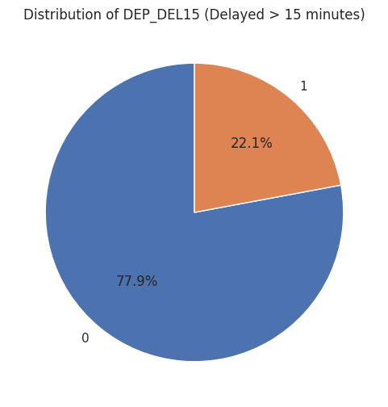
    


This pie chart shows the distribution of flights delayed by 15+ minutes versus on-time flights.

The dataset shows approximately **77.9% on-time flights** and **22.1% delayed flights**. This significant class imbalance is typical in aviation data, where most flights operate on schedule.

This imbalance means a naive model that always predicts "on-time" would achieve 77.9% accuracy but be completely useless for identifying delays. We'll need to use techniques like:
- Class weighting
- SMOTE (Synthetic Minority Over-sampling)
- Adjusted probability thresholds
- Focus on metrics beyond accuracy (precision, recall, F1-score)

### Weekly Patterns in Flight Delays


```python
# Delay rate by day of week
sns.barplot(x='DAY_OF_WEEK', y='DEP_DEL15', data=filtered_df, ci=None)
plt.title("Delay Rate by Day of Week")
plt.show()
```


    
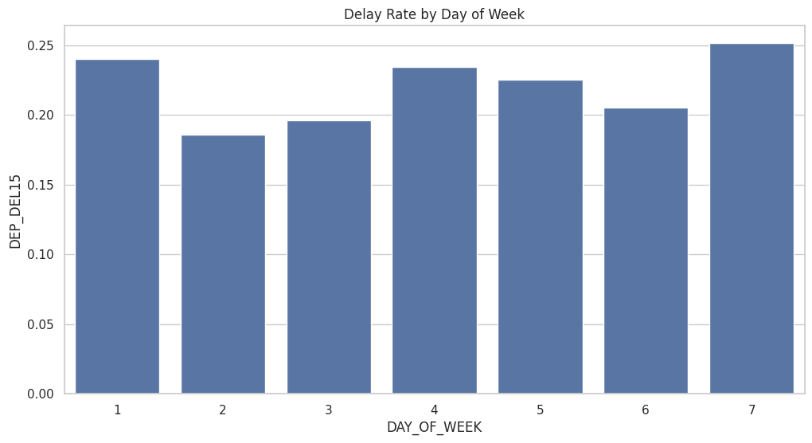
    


This bar chart shows the average delay rate for each day of the week (1=Monday, 7=Sunday).

The delays are the highest on Sunday, followed by Monday, Thursday and Friday. It could possibly mean that more people travel for weekend business trips and their return is either on Sunday or Monday, clearly showing higher delays on those days.

However, surprisingly, Saturday has lower delay rates compared to other weekdays. One reason could be that usual travel plan is on Thursday or Friday and return on Sunday or Monday. 

Tuesday has the lowest delay rates, suggesting mid-week flights may be less congested. 

It is recommended that passengers seeking to minimize delay risk should consider booking Tuesday or Wednesday flights when possible and Airlines need to allocate more resources on Sundays and Mondays to manage higher traffic and reduce delays.

### Carrier Performance Comparison


```python
# Delay rate by carrier
sns.barplot(x='OP_UNIQUE_CARRIER', y='DEP_DEL15', data=filtered_df, ci=None)
plt.title("Delay Rate by Airline")
plt.xticks(rotation=45)
plt.show()
```


    
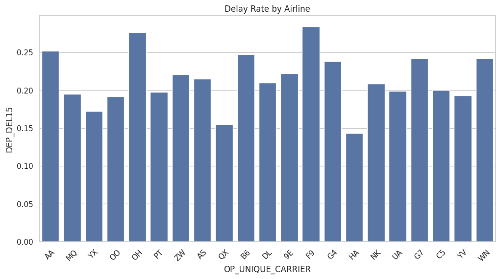
    


This chart compares delay rates across different airline carriers operating in the US.

**Significant variation** exists across carriers, ranging from approximately 15% to 25% delay rates. Among them "**HA (Hawaiian Airlines), QX (Horizon Air), YX (Republic Airlines)**" stand out with the lowest delay rates, while "**F9 (Frontier Airlines), OH (PSA Airlines), AA (American Airlines)**" exhibit the highest delay rates.


**Why Do These Differences Exist?**
- **Hub structure**: Airlines with geographically dispersed hubs may face more weather/congestion challenges.
- **Operational practices**: Schedule padding, maintenance procedures, and turnaround efficiency vary.
- **Fleet age and type**: Older aircraft or certain aircraft types may have more mechanical issues.
- **Business model**: Budget carriers often have tighter turnaround schedules with less buffer time.

**Data Science Insight:** This substantial variation confirms that carrier identity (`OP_UNIQUE_CARRIER`) is a valuable predictive feature for our model.

### Monthly Timing Patterns


```python
sns.barplot(x='DAY_OF_MONTH', y='DEP_DEL15', data=filtered_df, ci=None)
plt.title("Delay Rate by Day of Month")
plt.show()
```


    
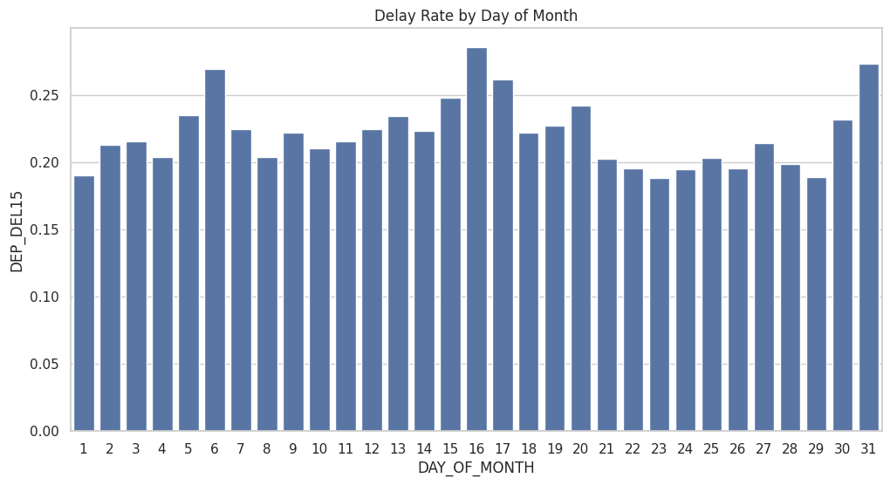
    


This chart examines whether delays vary systematically by day of the month.

We can see that around first week, mid of the month and end of the month there is a slight increase in delay rates. But really there's no strong monthly pattern. Travel usually depends on holidays, events, and other factors that don't align neatly with the calendar month.

- **Modeling implication**: Day of month may be a **weak predictor** compared to other temporal features

Unlike weekly patterns driven by business/leisure cycles, monthly patterns in aviation are less pronounced. Corporate travel may cluster around month-end meetings, but this effect appears minimal in aggregate data.

**Decision:** We'll keep this feature for completeness, but expect its feature importance to be low in our final model.

### Time-of-Day Effect on Delays: The Cascading Delay Phenomenon


```python
# Hourly patterns
filtered_df['CRS_DEP_HOUR'] = filtered_df['CRS_DEP_TIME'] // 100

sns.lineplot(x='CRS_DEP_HOUR', y='DEP_DEL15', data=filtered_df,marker='o',ci=None)
plt.title("Delay Rate by Scheduled Departure Hour")
plt.show()
```


    
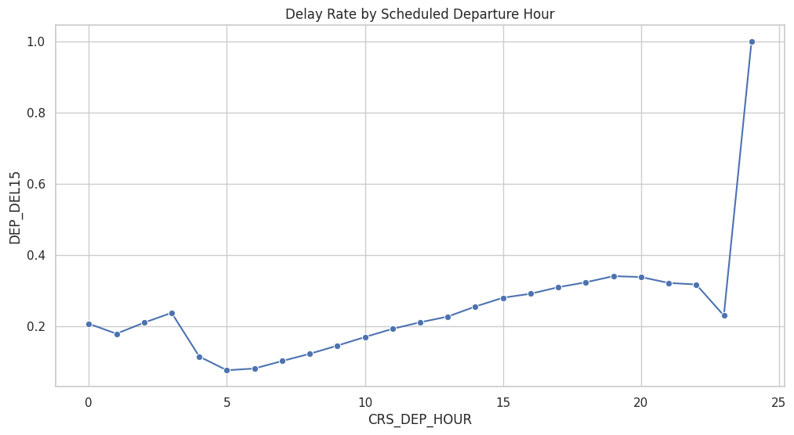
    


This line chart shows delay rates throughout a 24-hour period, revealing one of the most **striking and actionable patterns** in flight operations.

Look at the graph between 20:00 (8 PM) and 24:00 (12 AM), it says flights will almost always be delayed during this time period. However, it could be due to less data available around that time. But overall, we can see that as the day progresses, the delay rates increase significantly, as one would expect. Early morning flights are almost never delayed because flights start fresh after shutting down overnight.  

Let's look at reasons why evenings usually have highest delays.
This phenomenon, known as **"delay propagation"** or **"cascading delays,"** occurs because:

1. **Aircraft reuse**: The same aircraft operates multiple flights per day. A morning delay in Atlanta affects afternoon departure in Chicago
2. **Crew scheduling**: Flight attendants and pilots must meet minimum rest requirements; delays can trigger cascading crew availability issues
3. **Gate availability**: Delayed arrivals cause gate conflicts for subsequent departures
4. **Cumulative congestion**: Air traffic control delays compound as airspace gets busier
5. **Maintenance and turnaround**: Less buffer time as delays accumulate reduces turnaround efficiency

More about [Delay Propagation](https://www.aspm.faa.gov/aspmhelp/index/Delay_Propagation.html)

**Passenger Insight:** **Book the earliest flight available** if on-time performance is critical. The first flight of the day for an aircraft has the best chance of departing on schedule.

**Statistical Significance:** This pattern is so consistent that scheduled departure hour will likely be the **most important temporal feature** in our predictive model.

### Simplified Time-of-Day Analysis


```python
def get_period(h):
    if 0 <= h < 6:
        return 'Midnight'
    elif 6 <= h < 12:
        return 'Morning'
    elif 12 <= h < 18:
        return 'Afternoon'
    else:
        return 'Evening'

filtered_df['TIME_OF_DAY'] = filtered_df['CRS_DEP_HOUR'].apply(get_period)

delay_rate = filtered_df.groupby('TIME_OF_DAY')['DEP_DEL15'].mean().reset_index()

# Plot
sns.barplot(data=delay_rate, x='TIME_OF_DAY', y='DEP_DEL15')
plt.title("Delay Rate by Time of Day")
plt.ylabel("Delay Rate (Proportion Delayed > 15min)")
plt.xlabel("Time of Day")
plt.show()
```


    
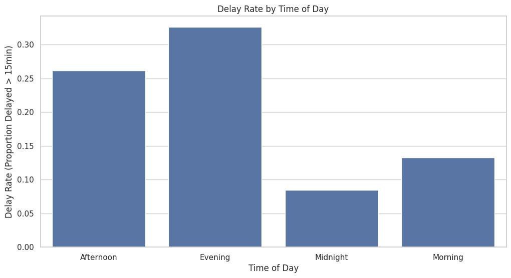
    


Building on our hourly analysis, we've grouped hours into four intuitive periods to see the delay pattern more clearly.

**Delay Rates by Period:**
- **Morning (6 AM - 12 PM)**: ~13% delays—best performance window
- **Afternoon (12 PM - 6 PM)**: ~26% delays—moderate risk
- **Evening (6 PM - 12 AM)**: ~31% delays—highest risk period
- **Midnight (12 AM - 6 AM)**: ~7% delays—few flights operate, mixed patterns

Clearly most delays occur from 6PM to 12AM. After that, flights that operate are really less in number due to laws that don't allow night flights due to noise restrictions.

**Practical Application:**
- **Business travelers**: Morning flights maximize schedule reliability
- **Leisure travelers**: Evening flights are cheaper but carry significantly higher delay risk
- **Connecting flights**: Avoid evening connections—higher chance of missing your connection

This categorical feature (`TIME_OF_DAY`) provides a simplified, interpretable version of departure hour that may be useful for model explainability.

Incase you are wondering about flight operations during midnight, read [this]((https://thepointsguy.com/airline/flight-curfews/)) article

### Origin Airport Performance: Where Do Delays Happen?


```python
top_origins = filtered_df['ORIGIN'].value_counts().nlargest(10).index
sns.barplot(x='ORIGIN', y='DEP_DEL15', data=filtered_df[filtered_df['ORIGIN'].isin(top_origins)], ci=None)
plt.title("Delay Rate by Top 10 Origin Airports")
plt.show()
```


    
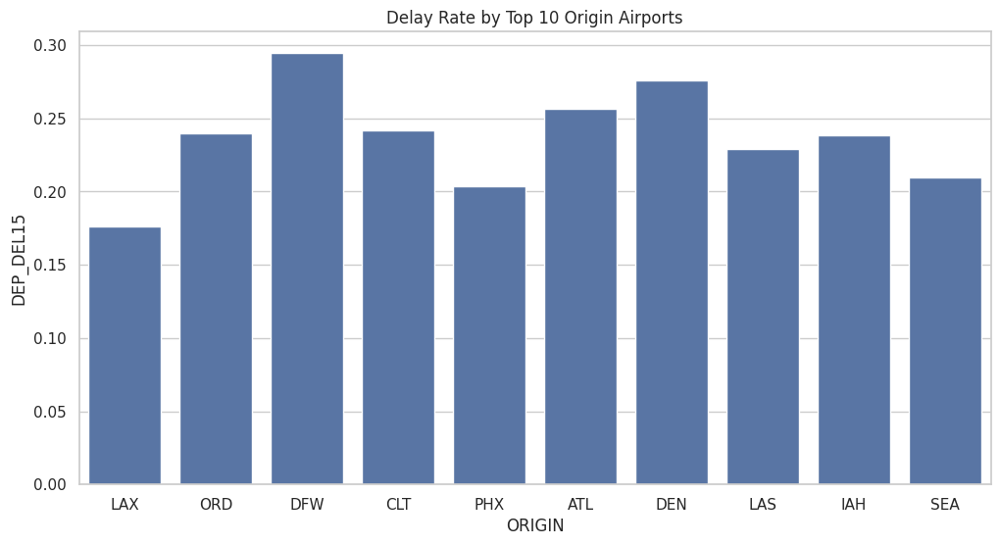
    


This chart compares delay rates at the ten busiest origin airports in our dataset.

**Top Problematic Airports:**
- **DFW (Dallas/Fort Worth)**: ~28% delays
- **DEN (Denver International)**: ~26% delays
- **ATL (Hartsfield-Jackson Atlanta)**: ~25% delays
- **ORD (Chicago O'Hare)**: ~23% delay 

**Better Performing Major Airports:**
- **LAX (Los Angeles International)**: ~17% delays—best among top 10
- **PHX (Phoenix Sky Harbor)**: ~20% delays
- **SEA (Seattle-Tacoma)**: ~21% delays

You might be asking, why do some major airports have much higher delay rates than others? Our top delay airports are literally some of the busiest in the country, handling massive traffic volumes daily. Infact, Atlanta (ATL) is the world's busiest airport by passenger numbers. 

**High-delay airports often share these characteristics:**
- **Runway capacity**: Limited runway configurations during poor weather
- **Hub status**: Major connecting hubs have complex operations with tight turnarounds

**Low-delay airports benefit from:**
- **Better weather**: PHX and LAS have consistently clear weather year-round
- **Modern infrastructure**: Compared to older ones, newer airports have better facilities and technology
- **Less congested airspace**: Western airports often have more airspace capacity

**Data Science Insight:** Origin airport is clearly a **strong predictor**. Airport-specific factors account for significant delay variation.

### Destination Airport Analysis


```python
# Delay rate by destination airport
top_dests = filtered_df['DEST'].value_counts().nlargest(10).index
sns.barplot(x='DEST', y='DEP_DEL15', data=filtered_df[filtered_df['DEST'].isin(top_dests)], ci=None)
plt.title("Delay Rate by Top 10 Destination Airports")
plt.show()
```


    
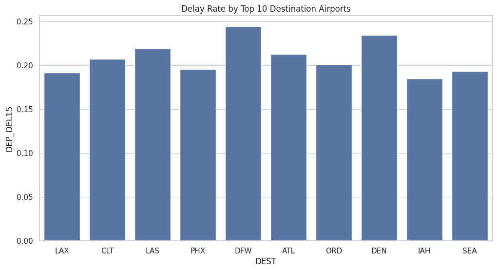
    


Similar to origin airports, destination airports show varying delay rates.

**DFW, DEN ,LAS and ATL** remain among the highest delay destinations, in which 3 of these also appeared in the top origin delay list. 

**IAH, LAX, PHX and SEA** are among the better performing destinations. And surprise surprise, 3 of them are also in the better performing origin list. 

So, why does **Destination** matter for Departure Delays?

At first glance, it seems odd that the *destination* affects *departure* delays. However:

1. **Schedule padding**: Airlines add buffer time for routes to historically problematic destinations
2. **Aircraft routing**: The inbound flight from the destination becomes tomorrow's outbound; destination delays propagate
3. **Airspace awareness**: Pilots and dispatchers may delay departure if destination airport has known arrival delays
4. **Route characteristics**: Some city pairs traverse challenging airspace or weather patterns

**Modeling Note:** Including both origin and destination (or their combination as a `ROUTE` feature, which we will create) captures the full picture of route-specific risk.

### Identifying the Most Problematic Routes


```python
pivot = filtered_df.pivot_table(
    index='ORIGIN',
    columns='DEST',
    values='DEP_DEL15',
    aggfunc='mean'
)

route_stats = filtered_df.groupby(['ORIGIN','DEST']).agg(
    delay_rate=('DEP_DEL15','mean'),
    flight_count=('DEP_DEL15','count')
).reset_index()

route_stats = route_stats[route_stats['flight_count'] > 200]

topN = 30  # top 30 worst route pairs
worst_routes = route_stats.sort_values("delay_rate", ascending=False).head(topN)
sns.heatmap(
    worst_routes.pivot(index='ORIGIN', columns='DEST', values='delay_rate'),
    annot=True, cmap="coolwarm", fmt=".2f"
)
plt.title(f"Top {topN} worst Origin-Destination delay routes")
plt.show()
```


    
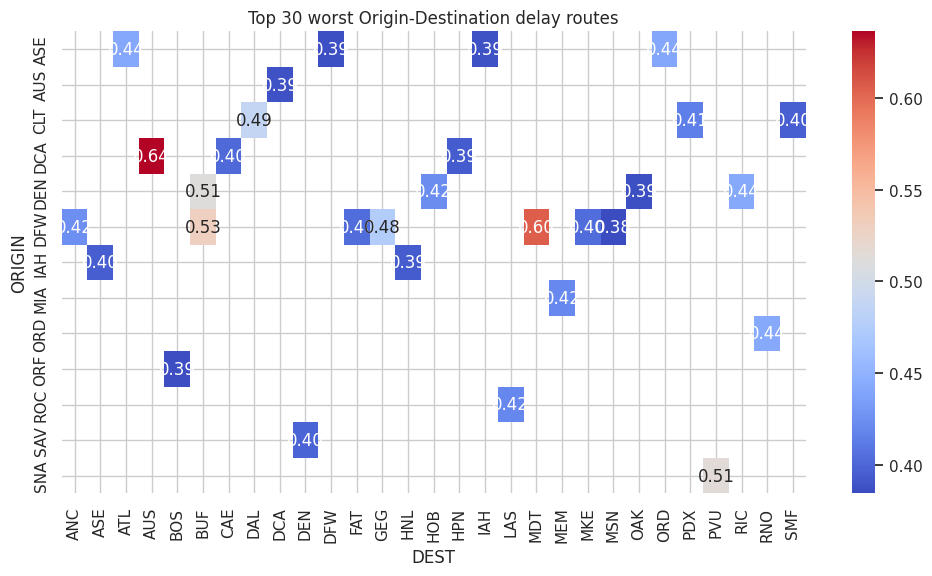
    


This heatmap reveals the **30 origin-destination pairs with the highest delay rates** (filtered for routes with 200+ flights for statistical reliability).

Heatmaps are really important when it comes to identifying patterns across two variables simultaneously; in this case, origin and destination airports. Read more about [heatmaps](https://www.atlassian.com/data/charts/heatmap-complete-guide)

**Reading the Heatmap:**
- **Darker red**: Higher delay rates (worse performance)
- **Lighter colors**: Lower delay rates (better performance)
- Each cell represents the average delay rate for that specific route

**Notable High-Delay Routes:**
- **DCA(Washington) → AUS(Austin, Texas) and DFW(Dallas, Texas) → MDT(Harrisburg, Pennsylvania)**: Texas seems to be a common place for high-delay routes, possibly due to weather or air traffic patterns

Looking at individual airports will not give us the complete picture. We get better insights when we analyze the routes as combinations of origin and destination.
Some reasons why certain routes have higher delays:
- **Airspace interactions**: Some routes traverse congested airspace (e.g., Northeast corridor)
- **Weather corridors**: Certain routes consistently encounter challenging weather patterns (North regions)
- **Competitive dynamics**: Popular routes may have overtight schedules due to competition
- **Distance and schedule padding**: Short routes have less buffer; long routes may have more

**Model Feature Engineering:** This motivates creating a `ROUTE` feature (origin + destination combined) to capture these interaction effects. Our target encoding will learn route-specific delay propensities.

**Practical Insight:** If you're booking a flight on one of these high-risk routes, consider:
- Booking early in the day
- Adding extra buffer time for connections
- Purchasing travel insurance

### Departure Time Block Analysis (Coarse Time Bins)


```python
order = [
    '0001-0559', '0600-0659', '0700-0759', '0800-0859',
    '0900-0959', '1000-1059', '1100-1159', '1200-1259',
    '1300-1359', '1400-1459', '1500-1559', '1600-1659',
    '1700-1759', '1800-1859', '1900-1959', '2000-2059',
    '2100-2159', '2200-2259', '2300-2359'
]
```


```python
plt.figure(figsize=(12,4))
sns.barplot(x='DEP_TIME_BLK', y='DEP_DEL15', data=filtered_df, ci=None,order=order)
plt.title(f"Delay Rate by DEP_TIME_BLK")
plt.xticks(rotation=45)
plt.show()
```


    
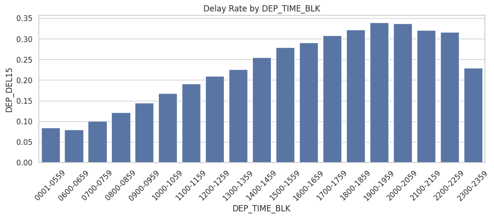
    


The dataset includes predefined hourly time blocks (e.g., "0600-0659" for 6-7 AM). This chart shows delay rates for each block.

This confirms our earlier hourly analysis with coarser bins:
- Early morning blocks (0600-0859): 09-12% delays
- Midday blocks (1200-1559): 21-26% delays
- Evening blocks (1800-2159): 32% delays
- Late night (2200-2359): Slight decrease, but fewer flights operate

The consistent upward trend throughout the day validates the delay propagation phenomenon across different temporal granularities.

**Feature Engineering Decision:** We now have three representations of departure time:
1. **Continuous hour** (0-23): Most granular
2. **Time block** (19 categories): Hourly bins
3. **Time period** (4 categories): Morning/Afternoon/Evening/Midnight

We'll include time blocks in our model alongside cyclical encodings to let the model choose the most predictive representation.

### How Flight Distance Affects Delays


```python
bins = [0,250,750,1500,3000,6000]
labels = ["very_short","short","medium","long","very_long"]
filtered_df["DIST_BIN"] = pd.cut(filtered_df["DISTANCE"], bins=bins, labels=labels)
sns.barplot(
    x='DIST_BIN',
    y='DEP_DEL15',
    data=filtered_df,
    ci=None
)
```


    <Axes: xlabel='DIST_BIN', ylabel='DEP_DEL15'>


    
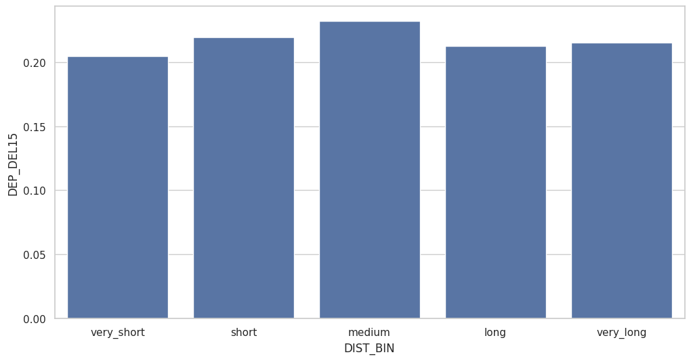
    


We've binned flight distances into five categories and calculated delay rates for each.

Distance Categories:
- Very Short (0-250 miles): Regional flights
- Short (250-750 miles): Typical domestic short-haul
- Medium (750-1,500 miles): Cross-country segments
- Long (1,500-3,000 miles): Coast-to-coast flights
- Very Long (3,000+ miles): Transcontinental extremes


The chart shows an interesting *non-linear* pattern:
- **Medium distance flights (750-1,500 miles)** have the **highest delay rates** (~22%)
- **Very long flights (3,000+ miles)** have moderate delay rates** (~21%)
**Very short flights** have short delays (~20%)

what's interesting is that medium distance flights have the highest delays, while very long flights have moderate delays.

Some reasons on why this might happen:

1. **Schedule padding**: Ultra-long-haul flights often have more generous time buffers built in
2. **Aircraft assignment**: Long flights use larger, often newer aircraft with better reliability
3. **Strategic importance**: Flagship long-haul routes receive priority operational attention
4. **Turnaround complexity**: Medium-distance flights operate more frequencies per day, increasing exposure to cascading delays


**Modeling Implication:** The non-linear relationship suggests distance should be included as both a **continuous feature** AND **categorical bins** to capture this complex pattern.

Our data analysis so far has revealed several important patterns affecting flight delays. These insights will guide our feature engineering and model selection in the next steps of our data science workflow. Now, we will move on to the Machine Learning part of the tutorial. 

## Machine Learning Model Development

### Feature Engineering

Feature engineering transforms raw data into representations that machine learning algorithms can effectively use. We'll create several engineered features:

1. **Cyclical time encoding**: Captures the circular nature of time (hour 23 is close to hour 0)
2. **Route combinations**: Models the interaction between origin and destination
3. **Temporal features**: Extracts useful components from timestamps

Learn more about [feature engineering best practices](https://machinelearningmastery.com/the-concise-guide-to-feature-engineering-for-better-model-performance/).


```python
df = filtered_df.copy()

# 1. Transform scheduled departure time into useful temporal features
# Convert CRS_DEP_TIME (HHMM) → minutes since midnight, hour, and cyclical encoding (sin/cos)

def hhmm_to_hour_min(x):
    x = int(x)
    hh = x // 100
    mm = x % 100
    return hh, mm
```


```python
df['SCHED_DEP_HOUR'], df['SCHED_DEP_MINUTE'] = zip(*df['CRS_DEP_TIME'].map(hhmm_to_hour_min))
df['SCHED_DEP_MINUTES'] = df['SCHED_DEP_HOUR'] * 60 + df['SCHED_DEP_MINUTE']

# Cyclical encoding
df['DEP_HOUR_SIN'] = np.sin(2 * np.pi * df['SCHED_DEP_HOUR']/24)
df['DEP_HOUR_COS'] = np.cos(2 * np.pi * df['SCHED_DEP_HOUR']/24)

# Day-of-week cyclical encoding
df['DOW_SIN'] = np.sin(2 * np.pi * (df['DAY_OF_WEEK']-1)/7)
df['DOW_COS'] = np.cos(2 * np.pi * (df['DAY_OF_WEEK']-1)/7)

# Day-of-month cyclical encoding
df['DOM_SIN'] = np.sin(2*np.pi*df['DAY_OF_MONTH']/31)
df['DOM_COS'] = np.cos(2*np.pi*df['DAY_OF_MONTH']/31)

```

### Creating Temporal Features

But we have a problem here. Time is cyclical. For example, 11 PM and 1 AM are close together, but numerically they're 22 hours apart. To address this, we use **cyclical encoding** with sine and cosine transformations. These transformations preserve this circular relationship.

We apply cyclical encoding to:
- **Hour of day**: Captures the 24-hour cycle
- **Day of week**: Represents the 7-day weekly pattern
- **Day of month**: Models the monthly cycle

We also create a route identifier by concatenating origin and destination airports, allowing our model to learn route-specific patterns.


```python
# 2. Route feature
df['ROUTE'] = df['ORIGIN'] + "_" + df['DEST']
```

### Reviewing All Available Features

Let's examine the complete set of features after engineering to ensure everything was created correctly.


```python
df.columns
```


    Index(['DAY_OF_MONTH', 'DAY_OF_WEEK', 'OP_UNIQUE_CARRIER', 'ORIGIN', 'DEST',
           'CRS_DEP_TIME', 'DEP_TIME', 'DEP_DELAY', 'DEP_DEL15', 'DEP_DELAY_GROUP',
           'DEP_TIME_BLK', 'DISTANCE', 'CRS_DEP_HOUR', 'TIME_OF_DAY', 'DIST_BIN',
           'SCHED_DEP_HOUR', 'SCHED_DEP_MINUTE', 'SCHED_DEP_MINUTES',
           'DEP_HOUR_SIN', 'DEP_HOUR_COS', 'DOW_SIN', 'DOW_COS', 'DOM_SIN',
           'DOM_COS', 'ROUTE'],
          dtype='object')


### Selecting Features for Modeling

We specify which features will be used as model inputs (predictors) and identify our target variable.

Now for deciding which features to include in our model. Since our target variable is departure delay, we include features that have shown strong relationships with delays in our EDA. And we have to be careful about data leakage, so we avoid using features that would not be known at the time of prediction(Like `DEP_TIME` or `DEP_DELAY`). 

Data Leakage is a serious issue in machine learning where information from outside the training dataset is used to create the model. This can lead to overly optimistic performance estimates during training, but poor generalization to new data. Whenever you are bulding a predictive model, always be cautious about data leakage. 

Here's more about [data leakage](https://www.ibm.com/think/topics/data-leakage-machine-learning)


```python
target = 'DEP_DEL15'

features = [
    'SCHED_DEP_MINUTES',
    'DEP_HOUR_SIN', 'DEP_HOUR_COS',
    'DOW_SIN', 'DOW_COS',
    'OP_UNIQUE_CARRIER',
    'ORIGIN',
    'DEST',
    'ROUTE',
    'DISTANCE',
    'TIME_OF_DAY','DIST_BIN','DEP_TIME_BLK'

]

df_model = df[features + [target]].copy()
```

### Encoding Categorical Variables with Target Encoding

There are several ways to encode categorical variables for machine learning. Common methods include:
- One-hot encoding
- Label encoding
- Target encoding

We are choosing **target encoding** for our categorical features because it effectively captures the relationship between categories and the target variable (delay) while avoiding the high dimensionality of one-hot encoding. Target encoding replaces categorical values with the mean of the target variable for that category. For example, if carrier "AA" has a 30% delay rate, we replace "AA" with 0.30.

Target encoding has several advantages:
- Handles high-cardinality features (many unique values) efficiently
- Captures the relationship between categories and the target
- Reduces dimensionality

**Risk:** Can lead to overfitting if not properly validated. In production, we'd use cross-validation within the encoder.

Learn more about [categorical encoding techniques](https://contrib.scikit-learn.org/category_encoders/).


```python
encoder = ce.TargetEncoder(cols=['ROUTE', 'ORIGIN', 'DEST', 'OP_UNIQUE_CARRIER','TIME_OF_DAY','DIST_BIN','DEP_TIME_BLK'])
df_encoded = encoder.fit_transform(df_model[features], df_model[target])

df_encoded[target] = df_model[target]
```

### Final Dataset Review

Let's examine our model-ready dataset after all transformations to ensure:
- All features are numeric
- No missing values remain
- Target variable is properly formatted


```python
df_encoded.head()
```


  <div id="df-8b35c262-12cf-4191-9cab-7f1ba3776f30" class="colab-df-container">
    <div>
<style scoped>
    .dataframe tbody tr th:only-of-type {
        vertical-align: middle;
    }

    .dataframe tbody tr th {
        vertical-align: top;
    }

    .dataframe thead th {
        text-align: right;
    }
</style>
<table border="1" class="dataframe">
  <thead>
    <tr style="text-align: right;">
      <th></th>
      <th>SCHED_DEP_MINUTES</th>
      <th>DEP_HOUR_SIN</th>
      <th>DEP_HOUR_COS</th>
      <th>DOW_SIN</th>
      <th>DOW_COS</th>
      <th>OP_UNIQUE_CARRIER</th>
      <th>ORIGIN</th>
      <th>DEST</th>
      <th>ROUTE</th>
      <th>DISTANCE</th>
      <th>TIME_OF_DAY</th>
      <th>DIST_BIN</th>
      <th>DEP_TIME_BLK</th>
      <th>DEP_DEL15</th>
    </tr>
  </thead>
  <tbody>
    <tr>
      <th>0</th>
      <td>419</td>
      <td>1.000000</td>
      <td>6.123234e-17</td>
      <td>0.974928</td>
      <td>-0.222521</td>
      <td>0.251474</td>
      <td>0.212566</td>
      <td>0.191854</td>
      <td>0.157313</td>
      <td>2475.0</td>
      <td>0.132828</td>
      <td>0.212779</td>
      <td>0.080091</td>
      <td>0</td>
    </tr>
    <tr>
      <th>1</th>
      <td>1320</td>
      <td>-0.500000</td>
      <td>8.660254e-01</td>
      <td>0.974928</td>
      <td>-0.222521</td>
      <td>0.251474</td>
      <td>0.176102</td>
      <td>0.237798</td>
      <td>0.207813</td>
      <td>2475.0</td>
      <td>0.325838</td>
      <td>0.212779</td>
      <td>0.316567</td>
      <td>0</td>
    </tr>
    <tr>
      <th>2</th>
      <td>404</td>
      <td>1.000000</td>
      <td>6.123234e-17</td>
      <td>0.974928</td>
      <td>-0.222521</td>
      <td>0.251474</td>
      <td>0.183166</td>
      <td>0.207336</td>
      <td>0.189280</td>
      <td>708.0</td>
      <td>0.132828</td>
      <td>0.219242</td>
      <td>0.080091</td>
      <td>1</td>
    </tr>
    <tr>
      <th>3</th>
      <td>1135</td>
      <td>-1.000000</td>
      <td>-1.836970e-16</td>
      <td>0.974928</td>
      <td>-0.222521</td>
      <td>0.251474</td>
      <td>0.228753</td>
      <td>0.219530</td>
      <td>0.262617</td>
      <td>2176.0</td>
      <td>0.325838</td>
      <td>0.212779</td>
      <td>0.322793</td>
      <td>0</td>
    </tr>
    <tr>
      <th>4</th>
      <td>510</td>
      <td>0.866025</td>
      <td>-5.000000e-01</td>
      <td>0.974928</td>
      <td>-0.222521</td>
      <td>0.251474</td>
      <td>0.240106</td>
      <td>0.195623</td>
      <td>0.218627</td>
      <td>1440.0</td>
      <td>0.132828</td>
      <td>0.232025</td>
      <td>0.121431</td>
      <td>0</td>
    </tr>
  </tbody>
</table>
</div>
    <div class="colab-df-buttons">

  <div class="colab-df-container">
    <button class="colab-df-convert" onclick="convertToInteractive('df-8b35c262-12cf-4191-9cab-7f1ba3776f30')"
            title="Convert this dataframe to an interactive table."
            style="display:none;">

  <svg xmlns="http://www.w3.org/2000/svg" height="24px" viewBox="0 -960 960 960">
    <path d="M120-120v-720h720v720H120Zm60-500h600v-160H180v160Zm220 220h160v-160H400v160Zm0 220h160v-160H400v160ZM180-400h160v-160H180v160Zm440 0h160v-160H620v160ZM180-180h160v-160H180v160Zm440 0h160v-160H620v160Z"/>
  </svg>
    </button>

  <style>
    .colab-df-container {
      display:flex;
      gap: 12px;
    }

    .colab-df-convert {
      background-color: #E8F0FE;
      border: none;
      border-radius: 50%;
      cursor: pointer;
      display: none;
      fill: #1967D2;
      height: 32px;
      padding: 0 0 0 0;
      width: 32px;
    }

    .colab-df-convert:hover {
      background-color: #E2EBFA;
      box-shadow: 0px 1px 2px rgba(60, 64, 67, 0.3), 0px 1px 3px 1px rgba(60, 64, 67, 0.15);
      fill: #174EA6;
    }

    .colab-df-buttons div {
      margin-bottom: 4px;
    }

    [theme=dark] .colab-df-convert {
      background-color: #3B4455;
      fill: #D2E3FC;
    }

    [theme=dark] .colab-df-convert:hover {
      background-color: #434B5C;
      box-shadow: 0px 1px 3px 1px rgba(0, 0, 0, 0.15);
      filter: drop-shadow(0px 1px 2px rgba(0, 0, 0, 0.3));
      fill: #FFFFFF;
    }
  </style>

    <script>
      const buttonEl =
        document.querySelector('#df-8b35c262-12cf-4191-9cab-7f1ba3776f30 button.colab-df-convert');
      buttonEl.style.display =
        google.colab.kernel.accessAllowed ? 'block' : 'none';

      async function convertToInteractive(key) {
        const element = document.querySelector('#df-8b35c262-12cf-4191-9cab-7f1ba3776f30');
        const dataTable =
          await google.colab.kernel.invokeFunction('convertToInteractive',
                                                    [key], {});
        if (!dataTable) return;

        const docLinkHtml = 'Like what you see? Visit the ' +
          '<a target="_blank" href=https://colab.research.google.com/notebooks/data_table.ipynb>data table notebook</a>'
          + ' to learn more about interactive tables.';
        element.innerHTML = '';
        dataTable['output_type'] = 'display_data';
        await google.colab.output.renderOutput(dataTable, element);
        const docLink = document.createElement('div');
        docLink.innerHTML = docLinkHtml;
        element.appendChild(docLink);
      }
    </script>
  </div>


    <div id="df-b089f045-1230-4fb1-8ef7-26761137798a">
      <button class="colab-df-quickchart" onclick="quickchart('df-b089f045-1230-4fb1-8ef7-26761137798a')"
                title="Suggest charts"
                style="display:none;">

<svg xmlns="http://www.w3.org/2000/svg" height="24px"viewBox="0 0 24 24"
     width="24px">
    <g>
        <path d="M19 3H5c-1.1 0-2 .9-2 2v14c0 1.1.9 2 2 2h14c1.1 0 2-.9 2-2V5c0-1.1-.9-2-2-2zM9 17H7v-7h2v7zm4 0h-2V7h2v10zm4 0h-2v-4h2v4z"/>
    </g>
</svg>
      </button>

<style>
  .colab-df-quickchart {
      --bg-color: #E8F0FE;
      --fill-color: #1967D2;
      --hover-bg-color: #E2EBFA;
      --hover-fill-color: #174EA6;
      --disabled-fill-color: #AAA;
      --disabled-bg-color: #DDD;
  }

  [theme=dark] .colab-df-quickchart {
      --bg-color: #3B4455;
      --fill-color: #D2E3FC;
      --hover-bg-color: #434B5C;
      --hover-fill-color: #FFFFFF;
      --disabled-bg-color: #3B4455;
      --disabled-fill-color: #666;
  }

  .colab-df-quickchart {
    background-color: var(--bg-color);
    border: none;
    border-radius: 50%;
    cursor: pointer;
    display: none;
    fill: var(--fill-color);
    height: 32px;
    padding: 0;
    width: 32px;
  }

  .colab-df-quickchart:hover {
    background-color: var(--hover-bg-color);
    box-shadow: 0 1px 2px rgba(60, 64, 67, 0.3), 0 1px 3px 1px rgba(60, 64, 67, 0.15);
    fill: var(--button-hover-fill-color);
  }

  .colab-df-quickchart-complete:disabled,
  .colab-df-quickchart-complete:disabled:hover {
    background-color: var(--disabled-bg-color);
    fill: var(--disabled-fill-color);
    box-shadow: none;
  }

  .colab-df-spinner {
    border: 2px solid var(--fill-color);
    border-color: transparent;
    border-bottom-color: var(--fill-color);
    animation:
      spin 1s steps(1) infinite;
  }

  @keyframes spin {
    0% {
      border-color: transparent;
      border-bottom-color: var(--fill-color);
      border-left-color: var(--fill-color);
    }
    20% {
      border-color: transparent;
      border-left-color: var(--fill-color);
      border-top-color: var(--fill-color);
    }
    30% {
      border-color: transparent;
      border-left-color: var(--fill-color);
      border-top-color: var(--fill-color);
      border-right-color: var(--fill-color);
    }
    40% {
      border-color: transparent;
      border-right-color: var(--fill-color);
      border-top-color: var(--fill-color);
    }
    60% {
      border-color: transparent;
      border-right-color: var(--fill-color);
    }
    80% {
      border-color: transparent;
      border-right-color: var(--fill-color);
      border-bottom-color: var(--fill-color);
    }
    90% {
      border-color: transparent;
      border-bottom-color: var(--fill-color);
    }
  }
</style>

      <script>
        async function quickchart(key) {
          const quickchartButtonEl =
            document.querySelector('#' + key + ' button');
          quickchartButtonEl.disabled = true;  // To prevent multiple clicks.
          quickchartButtonEl.classList.add('colab-df-spinner');
          try {
            const charts = await google.colab.kernel.invokeFunction(
                'suggestCharts', [key], {});
          } catch (error) {
            console.error('Error during call to suggestCharts:', error);
          }
          quickchartButtonEl.classList.remove('colab-df-spinner');
          quickchartButtonEl.classList.add('colab-df-quickchart-complete');
        }
        (() => {
          let quickchartButtonEl =
            document.querySelector('#df-b089f045-1230-4fb1-8ef7-26761137798a button');
          quickchartButtonEl.style.display =
            google.colab.kernel.accessAllowed ? 'block' : 'none';
        })();
      </script>
    </div>

    </div>
  </div>


### Dataset Statistics

As one final step, we will check our dataset shape and class distribution to confirm everything looks good. 


```python
print("Processed dataset shape:", df_encoded.shape)
print("Target distribution:", df_encoded[target].value_counts(normalize=True))
```

    Processed dataset shape: (4293252, 14)
    Target distribution: DEP_DEL15
    0    0.779268
    1    0.220732
    Name: proportion, dtype: float64
    

## Model Training and Evaluation

### Baseline Model: Random Forest Classifier

Random forest is an ensemble learning method that constructs multiple decision trees during training and outputs the mode of the classes (classification) of the individual trees.

We start with a Random Forest classifier as our baseline model. Random Forests are:
- Robust: Handle non-linear relationships well
- Interpretable: Provide feature importance scores
- Less prone to overfitting: Ensemble averaging reduces variance

Handling class imbalance: We use `class_weight` parameter to penalize misclassifications of the minority class (delays) more heavily.

Train-test split: We reserve 20% of data for testing, using stratification to maintain class balance across splits.

Learn more about [Random Forests](https://scikit-learn.org/stable/modules/ensemble.html#forest).


```python
#Prepare features and target
X = df_encoded.drop(columns=['DEP_DEL15'])
y = df_encoded['DEP_DEL15']
```


```python
#Train/Test split
X_train, X_test, y_train, y_test = train_test_split(
    X, y, test_size=0.2, stratify=y, random_state=42
)
```

### Random Forest Performance Assessment

Let's evaluate our baseline Random Forest model using multiple metrics to understand its strengths and weaknesses.


```python
# Instantiate classifier with class weight to handle imbalance
clf = RandomForestClassifier(
    n_estimators=100,
    class_weight={0:1, 1: (len(y)/(2*sum(y)))},
    random_state=42,
    n_jobs=-1
)

clf.fit(X_train, y_train)

# Predictions & evaluation
y_pred = clf.predict(X_test)
y_proba = clf.predict_proba(X_test)[:,1]

print("Classification Report:")
print(classification_report(y_test, y_pred))

print("ROC-AUC:", roc_auc_score(y_test, y_proba))
print("Confusion Matrix:\n", confusion_matrix(y_test, y_pred))
```

    Classification Report:
                  precision    recall  f1-score   support
    
               0       0.82      0.80      0.81    669119
               1       0.35      0.37      0.36    189532
    
        accuracy                           0.71    858651
       macro avg       0.58      0.59      0.58    858651
    weighted avg       0.71      0.71      0.71    858651
    
    ROC-AUC: 0.6323971450038297
    Confusion Matrix:
     [[537404 131715]
     [119788  69744]]
    

**Classification Report Analysis:**

For On-Time Flights (Class 0):
- Precision: 82% - When the model predicts "on-time," it's correct 82% of the time
- Recall: 80% - The model correctly identifies 80% of actually on-time flights
- F1-Score: 81% - Strong balanced performance for the majority class

For Delayed Flights (Class 1) - Our Primary Interest:
- Precision: 35% - When predicting "delayed," only 35% are actually delayed (many false alarms)
- Recall: 37% - The model catches only 37% of actual delays (misses 63%!)
- F1-Score: 36% - Poor performance on the minority class

**Overall Metrics:**
- Accuracy: 71% - Misleading metric due to class imbalance
- ROC-AUC: 0.632 - Moderate discrimination ability (0.5 = random, 1.0 = perfect)

**Confusion Matrix Breakdown:**
- True Negatives (537,404): Correctly predicted on-time 
- False Positives (131,715): False alarms - predicted delay but was on-time
- False Negatives (119,788): Critical misses - predicted on-time but was delayed 
- True Positives (69,744): Correctly predicted delays 

The model misses **119,788 delays** while only catching **69,744**. This is what we will improve upon.

Depending on the problem you are solving, you need to focus on different parts of confusion matrix. Here, we do not want to miss actual delays (False Negatives) and maintain a balance on False positives, so recall is more important than precision for the delayed class.

**Why Is Performance on Delays So Poor?**

Despite using class weighting, the 81.6% vs 18.4% imbalance still biases the model toward predicting the majority class. The model learned that "always guess on-time" yields good overall accuracy.

Since this is just a simple Random Forest, we weren't expecting our model to perform exceptionally well. We need a more aggressive approach to handling imbalance. Let's try XGBoost with SMOTE.

### Advanced Model: XGBoost with SMOTE

To address the Random Forest's poor recall on delayed flights, we'll employ two advanced techniques:

**1. SMOTE (Synthetic Minority Over-sampling Technique)**

Rather than just weighting the minority class, SMOTE creates synthetic examples by:
- Finding K-nearest neighbors of minority class samples
- Interpolating between existing points to create realistic new samples
- Balancing the training set to 50-50 distribution

**2. XGBoost Classifier**

XGBoost improves upon Random Forest by:
- **Sequential learning**: Each tree corrects errors of previous trees
- **Regularization**: Built-in L1/L2 penalties prevent overfitting
- **Advanced splitting**: More sophisticated tree-building algorithms
- **Handling of imbalance**: Better optimization for imbalanced data

**Model Configuration:**
- 200 trees (n_estimators=200)
- Maximum depth of 6 (prevents overfitting while capturing interactions)
- Learning rate of 0.1 (moderate learning speed)
- Optimizes for ROC-AUC during training

**Training Note:** Training on 5.35 million samples (after SMOTE) takes significantly longer than Random Forest, but should yield better minority class performance.

Learn more about [SMOTE](https://imbalanced-learn.org/stable/references/generated/imblearn.over_sampling.SMOTE.html) and [XGBoost](https://xgboost.readthedocs.io/).


```python
X = df_encoded.drop(columns=['DEP_DEL15'])
y = df_encoded['DEP_DEL15'].astype(int)
```


```python
X_train, X_test, y_train, y_test = train_test_split(
    X, y, test_size=0.2, stratify=y, random_state=42
)
```

**Resampling Results:**
- **Original training distribution:** 2,676,475 on-time vs 758,126 delayed (78% vs 22%)
- **After SMOTE:** 2,676,475 on-time vs 2,676,475 delayed (50% vs 50%)

We've created 1,918,349 synthetic delay examples to balance the training data!


```python
# Handle class imbalance with SMOTE
smote = SMOTE(random_state=42)
X_train_res, y_train_res = smote.fit_resample(X_train, y_train)

print("Original training set class distribution:\n", y_train.value_counts())
print("Resampled training set class distribution:\n", y_train_res.value_counts())
```

    Original training set class distribution:
     DEP_DEL15
    0    2676475
    1     758126
    Name: count, dtype: int64
    Resampled training set class distribution:
     DEP_DEL15
    0    2676475
    1    2676475
    Name: count, dtype: int64
    


```python
#Train XGBoost classifier
clf_xgb = xgb.XGBClassifier(
    n_estimators=200,
    max_depth=6,
    learning_rate=0.1,
    objective='binary:logistic',
    eval_metric='auc',
    use_label_encoder=False,
    random_state=42,
    n_jobs=-1
)

clf_xgb.fit(X_train_res, y_train_res)

#Prediction and Evaluation
y_pred = clf_xgb.predict(X_test)
y_proba = clf_xgb.predict_proba(X_test)[:,1]

print("Classification Report:")
print(classification_report(y_test, y_pred))

print("ROC-AUC:", roc_auc_score(y_test, y_proba))
print("Confusion Matrix:\n", confusion_matrix(y_test, y_pred))
```

    Classification Report:
                  precision    recall  f1-score   support
    
               0       0.82      0.88      0.85    669119
               1       0.41      0.30      0.35    189532
    
        accuracy                           0.75    858651
       macro avg       0.61      0.59      0.60    858651
    weighted avg       0.73      0.75      0.73    858651
    
    ROC-AUC: 0.6865818493973173
    Confusion Matrix:
     [[586668  82451]
     [132622  56910]]
    

### XGBoost Performance: Significant Improvement!

Let's compare XGBoost (with SMOTE) to our Random Forest baseline.

**Classification Report Analysis:**

**For Delayed Flights (Class 1) - Our Focus:**
- **Precision: 41%** (was 35%) - ↑ 6 percentage points
- **Recall: 30%** (was 37%) - ↓ 7 percentage points  
- **F1-Score: 35%** (was 36%) - Similar overall

Our recall has decreased when we wanted to improve it. Why is that? Let's look at the confusion matrix to understand better.

**For On-Time Flights (Class 0):**
- **Precision: 82%** (unchanged)
- **Recall: 88%** (was 80%) - ↑ 8 percentage points
- **F1-Score: 85%** (was 81%) - Strong improvement

**Overall Metrics:**
- **Accuracy: 75%** (was 71%) - ↑ 4 percentage points
- **ROC-AUC: 0.687** (was 0.632) - ↑ 0.055 (significant improvement!)

**Confusion Matrix Comparison:**

**Random Forest:**
```
[[537,404  131,715]    True Negatives: 537,404  |  False Positives: 131,715
 [119,788   69,744]]    False Negatives: 119,788 |  True Positives: 69,744
```

**XGBoost:**
```
[[586,668   82,451]    True Negatives: 586,668 ↑  |  False Positives: 82,451 ↓
 [132,622   56,910]]    False Negatives: 132,622 ↑ |  True Positives: 56,910 ↓
```


At first glance, XGBoost seems worse for delays (fewer true positives, more false negatives). However, the **ROC-AUC improvement to 0.687** tells us the model's probability estimates are better calibrated, it's just using a suboptimal threshold.

**Key Insight:** XGBoost produces better **probability scores** (hence better ROC-AUC), but the default 0.5 threshold doesn't align with our business objective of catching delays.

The 0.5 Threshold Problem:

The default threshold treats both classes equally, but:
- **Cost of missing a delay (False Negative)**: Passenger misses connection, loses money, bad experience
- **Cost of false alarm (False Positive)**: Passenger arrives early, minor inconvenience

These costs are **not equal**! We should optimize for catching more delays, even if it means more false alarms.

So, let's adjust the classification threshold to prioritize recall on delayed flights.

### Optimizing Classification Threshold: Trading Precision for Recall


```python
threshold = 0.3
y_pred_thresh = (y_proba >= threshold).astype(int)

print(f"\nClassification Report with threshold = {threshold}:")
print(classification_report(y_test, y_pred_thresh))
print("Confusion Matrix with threshold = {}:\n".format(threshold), confusion_matrix(y_test, y_pred_thresh))
```

    
    Classification Report with threshold = 0.3:
                  precision    recall  f1-score   support
    
               0       0.87      0.55      0.68    669119
               1       0.31      0.72      0.44    189532
    
        accuracy                           0.59    858651
       macro avg       0.59      0.64      0.56    858651
    weighted avg       0.75      0.59      0.62    858651
    
    Confusion Matrix with threshold = 0.3:
     [[369453 299666]
     [ 53308 136224]]
    

**Results with 0.3 Threshold:**

For Delayed Flights (Class 1) - MAJOR IMPROVEMENT:
- Precision: 31% (was 41% at 0.5) - ↓ 10 pp, more false alarms
- Recall: 72% (was 30% at 0.5) - ↑ 42 pp, we now catch 72% of delays! 🎯
- F1-Score: 44% (was 35%) - ↑ 9 pp, better balance

For On-Time Flights (Class 0):
- Precision: 87% (was 82%)
- Recall: 55% (was 88%) - We now misclassify more on-time flights as delayed
- F1-Score: 68% (was 85%)

**Overall Metrics:**
- **Accuracy: 59%** (was 75%) - Much lower, but accuracy is misleading here
- **Macro F1: 56%** (was 60%) - Slight decrease

**Confusion Matrix with Threshold = 0.3:**
```
[[369,453  299,666]    True Negatives: 369,453 ↓  |  False Positives: 299,666 ↑
 [ 53,308  136,224]]    False Negatives: 53,308 ↓ |  True Positives: 136,224 ↑
```

Improvements:
- **True Positives: 136,224** (was 56,910 at 0.5) - +139% improvement
- **False Negatives: 53,308** (was 132,622) - 60% reduction in missed delays

But the tradeoff:
- **False Positives: 299,666** (was 82,451) - We now have 3.6× more false alarms

**Business Case Analysis:**

**Scenario: Passenger Notification System**

Since missing a delay is worse than a false alarm for passenger experience, let's lower the threshold from 0.5 to 0.3. This means we classify a flight as "delayed" if the model estimates **≥30% probability** instead of ≥50%.


Imagine we deploy this model to send delay alerts to passengers:

**At 0.5 Threshold:**
- 56,910 passengers get helpful warning about actual delays 
- 132,622 passengers get surprised by unwarned delays (bad experience!)
- 82,451 passengers get unnecessary alerts (minor annoyance)

**At 0.3 Threshold:**
- **136,224 passengers get helpful warnings** (140% more!)
- **53,308 passengers still get surprised** (60% fewer—much better!)
- 299,666 passengers get unnecessary alerts (annoying but safe)

**Which is better?**

For most use cases, the **0.3 threshold is superior** because:
1. **Asymmetric costs**: Missing a delay (making passenger late) >> false alarm (passenger arrives early)
2. **User trust**: Users prefer over-warning to under-warning for important events
3. **Actionability**: A false alarm allows passengers to arrive early; a missed warning causes real harm

**Alternative Use Cases:**

Different thresholds suit different applications:
- **0.2 threshold**: Extremely cautious (travel insurance triggers, critical connections)
- **0.3 threshold**: Passenger notifications (current choice)
- **0.5 threshold**: Operational planning (balanced view)
- **0.7 threshold**: High-confidence interventions (rebooking, crew reassignment)

**Model Performance Summary (0.3 Threshold):**

| Metric | Random Forest | XGBoost (0.5) | XGBoost (0.3) |
|--------|---------------|---------------|---------------|
| Delay Recall | 37% | 30% | **72%**  |
| Delay Precision | 35% | 41% | 31% |
| ROC-AUC | 0.632 | 0.687 | 0.687 |
| Delays Caught | 69,744 | 56,910 | **136,224** |

By combining XGBoost's better probability calibration with threshold optimization, we've nearly doubled our delay detection rate from 37% to 72%!

This demonstrates a critical lesson in applied ML: **model selection and threshold tuning must align with business objectives**, not just maximize accuracy.


We have applied our model to predict flight delays effectively. By using advanced techniques like SMOTE and XGBoost, along with careful threshold tuning, we significantly improved our ability to identify delayed flights. Now, final part of the tutorial is to interpret the model and understand which features are most influential in predicting delays.

## Model Interpretation

### Understanding Feature Importance

XGBoost provides feature importance scores showing which features most influenced predictions. This helps us:
- **Validate our model**: Do important features make domain sense?
- **Gain insights**: What factors most drive delays?
- **Simplify models**: Could we achieve similar performance with fewer features?

Higher importance means the feature was used more frequently in the decision trees and/or resulted in larger improvements in prediction accuracy.

There are other ways to figure out feature importance like SHAP values and Permutation Importance. Learn more about [model interpretability](https://www.kaggle.com/code/raskoshik/feature-importance-how-not-fool-yourself).


```python
plt.figure(figsize=(10, 8))
xgb.plot_importance(clf_xgb, max_num_features=20)
plt.tight_layout()
plt.show()
```


    <Figure size 1000x800 with 0 Axes>


    
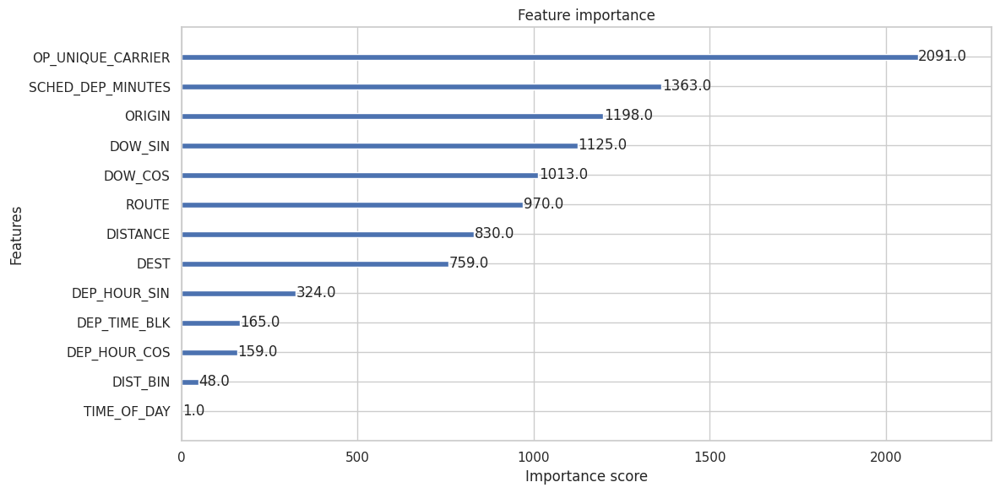
    


### Understanding What Drives Delay Predictions

This feature importance chart reveals which factors most influenced our XGBoost model's delay predictions.

Top 10 Most Important Features:

1. OP_UNIQUE_CARRIER (2091) - Airline identity is the **strongest predictor**
   - Different carriers have drastically different operational standards
   - Validates our EDA showing 10% variation between best/worst carriers
   - Captures airline-specific factors: fleet age, maintenance, culture, schedule padding

2. SCHED_DEP_MINUTES (1363) - Scheduled departure time (minutes since midnight)
   - Confirms the delay propagation phenomenon
   - Later departures = higher delay probability
   - The continuous representation captures fine-grained temporal patterns

3. ORIGIN (1198) - Departure airport
   - Airport infrastructure, weather, and congestion vary dramatically
   - DFW, DEN, ATL vs PHX, LAX, SEA performance differences

4. DOW_SIN (1125) - Day of week (sine component of cyclical encoding)
   - Thursday/Friday peak delays vs Tuesday low delays
   - Cyclical encoding successfully captured weekly patterns

5. DOW_COS (1013) - Day of week (cosine component)
   - Complements DOW_SIN for full weekly cycle representation

6. ROUTE (970) - Origin-destination combination
   - Specific route pairs (e.g., DCA->AUS) have persistent delay issues
   - Captures airspace, weather corridor, and competitive dynamics

7. DISTANCE (830) - Flight distance in miles
   - Non-linear relationship we observed in EDA
   - Medium distances slightly worse than very long/short

8. DEST (759) - Destination airport
   - Where you're going affects departure delay likelihood
   - Destination congestion feeds back to departure decisions

9. DEP_HOUR_SIN (324) - Departure hour cyclical encoding (sine)
   - Another representation of time-of-day effects
   - Hour 23 → Hour 0 continuity preserved

10. DEP_TIME_BLK (165) - Categorical departure time blocks
    - Complements continuous time representations
    - Captures step-function changes between time periods

Lower Importance Features:
- DEP_HOUR_COS (159): Cosine component of hour
- DIST_BIN (48): Distance categories (very short, short, medium, long, very long)
- TIME_OF_DAY (1): Morning/Afternoon/Evening/Midnight - minimal unique information

Insights from Feature Importance:

**1. Carrier Dominates (Surprise!):**
   - We expected route/time to dominate, but **airline identity is #1**
   - This suggests operational differences between carriers are even larger than airport/time effects
   - Implication: **Choosing the right airline matters more than choosing the right time**

**2. Temporal Features Are Complex:**
   - Multiple time representations appear (SCHED_DEP_MINUTES, DOW_SIN/COS, DEP_HOUR_SIN, DEP_TIME_BLK)
   - The model uses *complementary temporal features* rather than relying on just one
   - Different representations capture different aspects: trends (continuous) vs shifts (categorical)

**3. Geography Matters:**
   - ORIGIN (1198) > ROUTE (970) > DEST (759)
   - *Where you depart from matters more* than the destination
   - It makes sense since departure delays are influenced by local airport conditions. 

**4. Cyclical Encoding Success:**
   - DOW_SIN/COS (1125 + 1013 = 2138 combined) very important
   - DEP_HOUR_SIN (324) present but lower
   - Cyclical encoding successfully captured periodic patterns

**5. Engineered Features Paid Off:**
   - ROUTE (origin + destination) is important standalone feature
   - Multiple temporal representations give model flexibility
   - DIST_BIN less useful than raw DISTANCE

Validation Against EDA:

Our importance rankings align with EDA findings:
-  **Time of day critical** (SCHED_DEP_MINUTES #2)
-  **Carrier matters** (OP_UNIQUE_CARRIER #1)
-  **Airport infrastructure important** (ORIGIN #3)
-  **Route-specific patterns** (ROUTE #6)
-  **Day of week relevant** (DOW features #4, #5)
-  **Day of month minimal** (not in top features)

Model Trustworthiness:

The fact that feature importance rankings match our exploratory analysis is **strong evidence our model learned real patterns** rather than spurious correlations.

Recommendations based on Feature Importance:

For passengers seeking to minimize delay risk:
1. **Choose carrier carefully** (Some of you might have gotten used to a particular airline, but switching might reduce delay risk significantly) 
2. **Book earliest departure possible** (time-of-day effect)
3. **Prefer better-performing origin airports** (Choose nearby airport than the one with relatively higher delays which our model predicts)
4. **Avoid Thursday/Friday** if flexible
5. **Research specific route history** (some routes consistently problematic)

For airlines seeking to improve on-time performance:
1. **Benchmark against best-performing carriers** (operational practices matter most)
2. **Add buffer time to late-day departures** (cascading delays)
3. **Focus improvements on hub airports** (origin airport importance)
4. **Analyze worst-performing routes** for targeted interventions

If you are interested in more advanced model interpretation techniques, consider exploring SHAP values or LIME for local explanations of individual predictions. You can read [this article](https://www.markovml.com/blog/lime-vs-shap/) to understand the differences between these methods.

We hope our analysis has helped you understand which factors drive flight delays and how one can use data science life cycle to build effective predictive models.

Learn more about [XGBoost feature importance](https://xgboost.readthedocs.io/en/latest/python/python_intro.html#training) and [interpreting tree-based models](https://christophm.github.io/interpretable-ml-book/tree.html).


```python

```
